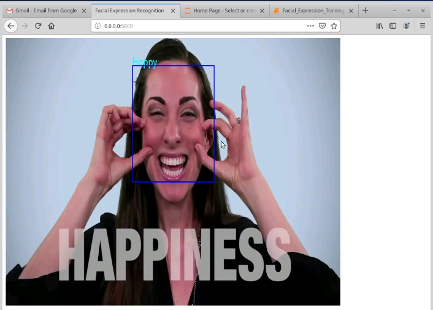
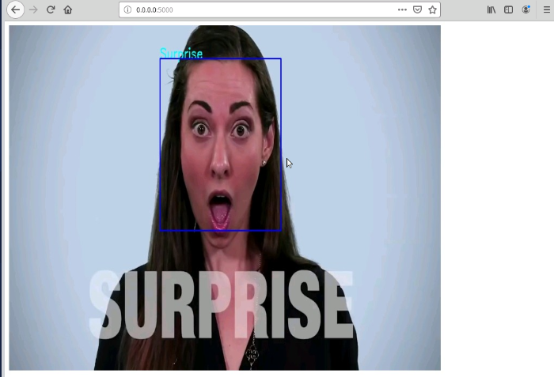
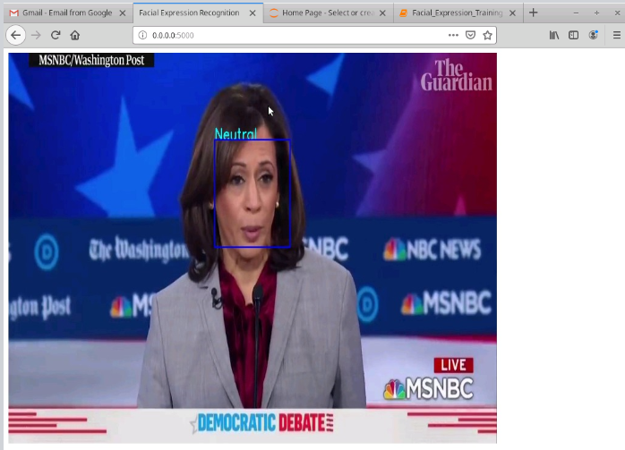
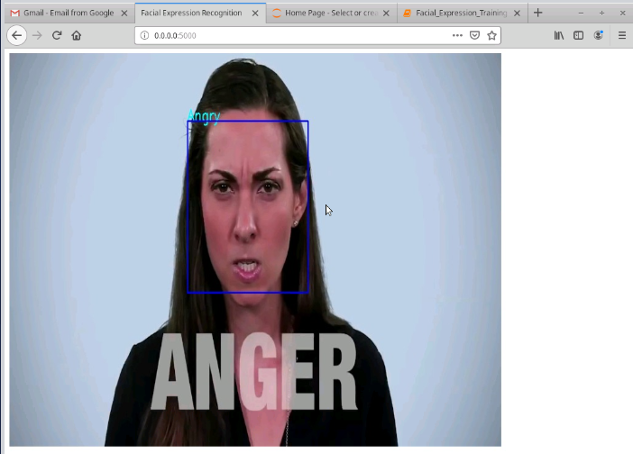

# Facial-Expression-Recognition
A real time facial expression recognition using deep learning and flask.

Kaggle Challenge - https://www.kaggle.com/c/challenges-in-representation-learning-facial-expression-recognition-challenge/data

Using the trained model and weights we use the predictions to predict on a video/real-time webcam feed using flask.

Model accuracy - 63%

## Demo

 

 

### Prerequisites
```
 pip3 install numpy
 pip3 install pandas
 pip3 install livelossplot
 pip3 install opencv-python
 pip3 install tensorflow
 pip3 install Flask
```

### Method-1: Using the trained model

Open terminal and run the command
```
  python3 main.py
```

Then open localhost at port 5000 ie 0.0.0.0:5000

### Method-2: Using it for real time webcam feed

Open `camera.py` and change 
```
self.video = cv2.VideoCapture("videos/presidential_debate.mp4")
```

To

```
self.video = cv2.VideoCapture(0)
```

Start the Flask server again using:
```
  python3 main.py
```

### Method-3: Training the model from scratch

Download dataset converted to images: https://drive.google.com/folderview?id=1naJSZnGSCmLmPpaD1x0Y1PwzSnMGtUAF
Use `Facial_Expression_Training.ipynb` to change the architecture of the model and start training again.
